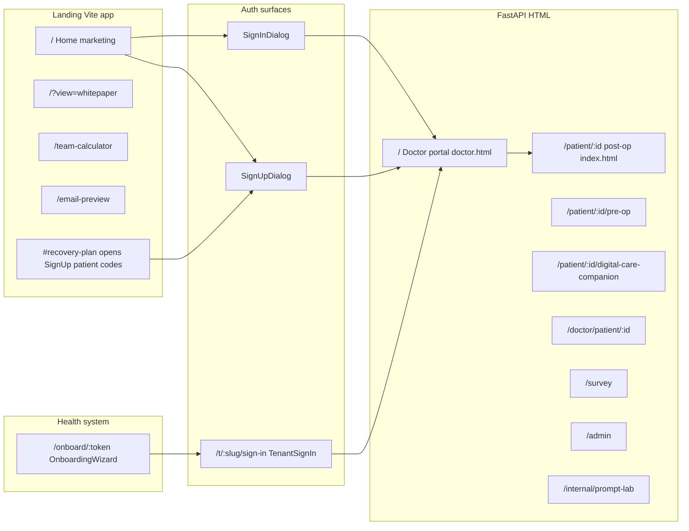

# Surgeon Persona UX Audit

**Persona:** Senior orthopedic surgeon, 52, 22 years in practice, low tech patience, 10 minutes between cases, no tutorial tolerance.  
**Bar:** Epic / Cerner / Doximity / basic iPhone expectations.  
**Method:** Code and markup review of [landing/](landing/), [frontend/](frontend/), and route wiring in [backend/main.py](backend/main.py). No live browser capture; “current state” is reconstructed from UI structure and copy.

---

## Journey map (all user-facing routes)

**Secondary:** [frontend/upload.html](frontend/upload.html) (PDF path in doctor flow uses `/api/upload-pdf`), internal email preview route in backend.

---

### Landing — Home (`/`, `LandingContent`)

**Description of current state:** Dark marketing page: animated hero, headline “The Platform to Win at TEAM”, primary CTA is external **Book a demo** (Calendly). Header: logo, tabs Home / TEAM white paper / TEAM calculator, Sign in / Sign up. Sticky header with cyan accent on active tab.

1. **Issue:** First screen sells “TEAM” and demos, not “your patients today.” **Impact:** Surgeon told to “check out the platform” lands on marketing, not workflow. **Recommendation:** Add a single above-the-fold path: “Clinician sign in” as large as Book a demo, or default logged-out state to sign-in modal for `?ref=clinical`. **Priority:** P1  
2. **Issue:** Hero uses animated GIF + motion headline. **Impact:** Cognitive noise + motion sensitivity; reads as startup, not clinical tool. **Recommendation:** Static clinical hero option; reduce motion. **Priority:** P2  
3. **Issue:** Three nav tabs + two auth buttons = five competing actions before purpose is clear. **Impact:** Violates “one obvious thing.” **Recommendation:** Collapse marketing tabs behind “Learn more”; foreground Sign in. **Priority:** P1  
4. **Issue:** Mobile: header `flex-wrap`, nav `order: 3` full width ([SiteHeader.tsx](landing/src/app/components/SiteHeader.tsx)) — auth can feel separated from brand. **Impact:** Thumb reach / scan confusion. **Recommendation:** Auth row fixed top-right on small screens; hamburger for marketing. **Priority:** P2  

---

### Landing — TEAM white paper (`/?view=whitepaper`)

**Description:** Alternate view via query param; long-form marketing (`TeamWhitepaperPage`).

1. **Issue:** Deep link is non-obvious (`?view=whitepaper`). **Impact:** Nobody bookmarks this; perioperative director won’t send that URL. **Recommendation:** Use path `/team-whitepaper` with redirect. **Priority:** P2  

---

### Landing — TEAM calculator (`/team-calculator`)

**Description:** Interactive calculator page (`TeamCalculator`).

1. **Issue:** Same product family but different mental model from patient care. **Impact:** Surgeon exploring “the platform” may think this *is* the product. **Recommendation:** Label sidebar/header “Planning tool — not patient chart.” **Priority:** P2  

---

### Landing — Sign in (`SignInDialog`)

**Description:** Modal: step “role” → Patient (codes) or Doctor (email/password). Patient path calls `/api/patient/by-codes` then hard redirect to `dashboard_url`. Doctor path uses `login()` → JWT.

1. **Issue:** First step forces a role choice before any context. **Impact:** Extra tap; wrong choice if surgeon clicks Patient by mistake. **Recommendation:** Default to Doctor when `VITE_DASHBOARD_URL` set; “Not a clinician?” link for patients. **Priority:** P1  
2. **Issue:** Tenant staff who try public login get API error string from `/api/auth/login` (backend returns 403 + “use workspace URL”). **Impact:** Looks like product is broken; no in-UI explanation. **Recommendation:** Catch 403 in [auth-api.ts](landing/src/lib/auth-api.ts) / dialog and show one line: “Use the sign-in link from your hospital email.” **Priority:** P0  
3. **Issue:** Doctor sign-in success depends on silent `getDoctorProfile(token)` redirect ([SiteHeader.tsx](landing/src/app/components/SiteHeader.tsx)); if profile missing, user may sit on landing with no clear next step. **Impact:** First-60-second abandonment. **Recommendation:** If profile null after login, open inline “Complete clinic profile” instead of doing nothing. **Priority:** P0  

---

### Landing — Sign up (`SignUpDialog`)

**Description:** Role → register → **doctor-onboard** (name, office phone, type, hospital) → POST `/api/doctor/onboard` → redirect `DASHBOARD_URL#auth=token`. Patient path: codes only.

1. **Issue:** “Sign up” implies self-service access; real health-system flow is invite/onboarding elsewhere. **Impact:** Wrong mental model for enterprise buyers. **Recommendation:** Rename to “Create demo account” or gate behind env flag. **Priority:** P1  
2. **Issue:** After register, doctor must complete another full form before redirect. **Impact:** Two onboarding UIs (this + doctor portal modal). **Recommendation:** Merge into one flow post-login. **Priority:** P1  
3. **Issue:** `DASHBOARD_URL` fallback chain is easy to misconfigure in prod. **Impact:** Redirect to wrong host or blank. **Recommendation:** Fail loudly in UI if unset in production build. **Priority:** P1  

---

### Landing — Recovery plan deep link (`#recovery-plan`)

**Description:** [SiteHeader.tsx](landing/src/app/components/SiteHeader.tsx) opens `SignUpDialog` with `patient-codes` and strips hash.

1. **Issue:** Uses **Sign up** dialog, not Sign in, for patients coming from email. **Impact:** “I already have codes” feels like they must register. **Recommendation:** Open patient code entry on neutral title “Access recovery plan” from both Sign in and email link. **Priority:** P1  

---

### Email preview route (`/email-preview`)

**Description:** Dev/marketing preview of recovery email (`RecoveryResourcesEmailPreview`).

1. **Issue:** Looks like a real app page if someone stumbles on URL. **Impact:** Confusion. **Recommendation:** Robots noindex + banner “Internal preview.” **Priority:** P2  

---

### Health system onboarding (`/onboard/:token`, `OnboardingWizard`)

**Description:** Full-screen wizard: Step 1 identity → Step 2 OTP send/verify → Step 3 org → Step 4 add team members + Finish → redirect `sign_in_url`.

1. **Issue:** Title “Health system onboarding” and copy “Director of TEAM Initiative (assigned automatically)” ([OnboardingWizard.tsx](landing/src/app/components/OnboardingWizard.tsx)). **Impact:** Surgeon not doing org setup will bounce; role label is jargon. **Recommendation:** Director vs surgeon paths; plain language “Verify hospital.” **Priority:** P1  
2. **Issue:** Step 4 puts “Add member” and “Finish onboarding” as equal-weight stacked buttons. **Impact:** No clear primary; risk of finishing without adding anyone. **Recommendation:** Finish = primary; Add member = secondary outline. **Priority:** P1  
3. **Issue:** OTP dependency on email config (503 if missing). **Impact:** Hard stop with no offline fallback in UI. **Recommendation:** Surface “IT must enable email” with contact line. **Priority:** P1  
4. **Issue:** Mobile: narrow form is fine; long vertical scroll for step 4. **Impact:** Fatigue. **Recommendation:** Sticky footer with primary action. **Priority:** P2  

---

### Tenant sign-in (`/t/:slug/sign-in`, `TenantSignIn`)

**Description:** Minimal slate form: “Health system sign in”, workspace slug, email/password, submit → `DASHBOARD/#auth=token`.

1. **Issue:** Raw slug in subtitle (“Workspace: acme-hospital”) — internal identifier feel. **Impact:** Trust/clarity. **Recommendation:** Fetch display name from API if available. **Priority:** P2  
2. **Issue:** Single column; good. Error is red text only. **Impact:** Easy to miss. **Recommendation:** Alert role + icon. **Priority:** P2  
3. **Issue:** No “Forgot password” or help. **Impact:** Dead end for real users. **Recommendation:** Link to hospital IT or mailto. **Priority:** P1  

---

### Doctor portal — Shell & first paint (`/`, [frontend/doctor.html](frontend/doctor.html))

**Description:** Two-column layout: left sidebar (logo, profile card, five tabs, Sign out), main content area. Default tab Patient Roster.

1. **Issue:** `onboardingModal` has class `active` on load — **blocking modal** before roster is usable. **Impact:** First 60 seconds: cannot see roster until “Save Profile” completes localStorage profile. **Recommendation:** Non-blocking banner + inline required fields on roster; or auto-dismiss if profile exists. **Priority:** P0  
2. **Issue:** Sign out is `href="/auth/signout"` which redirects to **landing** with `signout=1` — leaves doctor portal host. **Impact:** If they expected to stay on same site, disorienting. **Recommendation:** Clear copy “Return to marketing site” or unified domain strategy. **Priority:** P2  
3. **Issue:** “Audit Log” tab `display:none` unless tenant slug — discoverability zero. **Impact:** Power users never find it. **Recommendation:** Show disabled with tooltip if not tenant. **Priority:** P2  
4. **Issue:** At `max-width: 1120px`, sidebar stacks; tabs become 3-column grid then 1-column at 860px. **Impact:** Five vertical tab labels on phone is long. **Recommendation:** Icon + short labels or bottom nav for mobile. **Priority:** P1  

---

### Doctor portal — Patient Roster

**Description:** Title “Patient Roster”, subtitle about selecting row for timeline, Notifications bell, **+ Add Patient**, search, scrollable list (grid columns: name pill pre/post, phone, email, episode day, intake pill for pre-op).

1. **Issue:** Subtitle says “timeline details” but pre-op rows open **pre-op detail** modal, not timeline. **Impact:** Mistrust of UI copy. **Recommendation:** Dynamic subtitle by episode type. **Priority:** P1  
2. **Issue:** Cold start: `0 patients` until someone uses Add Patient. **Impact:** “Is this broken?” in first glance. **Recommendation:** Empty state card: “Add your first patient” + 3 bullet what happens next. **Priority:** P0  
3. **Issue:** Episode day column without label “Post-op day” vs “Days to surgery.” **Impact:** Cannot triage panel in 30s for pre-op. **Recommendation:** Column header + pre-op countdown from `scheduled_surgery_date` when available. **Priority:** P0** (operational gap: no T-96/T-48/T-24 in codebase)**  
4. **Issue:** Intake pill and roster cells are small text (13px). **Impact:** Arm’s-length phone reading. **Recommendation:** 16px minimum for primary columns. **Priority:** P1  

---

### Doctor portal — Add Patient modal

**Description:** Step 1 episode type (Pre-Op vs Post-Op cards) → form: name, phone, email, conditional surgery date (pre-op), discharge notes **or** PDF upload, processing overlay, Generate Resources.

1. **Issue:** Two-step modal with dense clinical paste area. **Impact:** High cognitive load between cases. **Recommendation:** Pre-select episode from roster context when possible; default post-op if that’s 80% use. **Priority:** P1  
2. **Issue:** PDF upload failure silently clears text in some paths. **Impact:** Data loss anxiety. **Recommendation:** Explicit “Extracted N pages” confirmation. **Priority:** P1  
3. **Issue:** “Generate Resources” is the only primary — good — but processing state hides entire form. **Impact:** Cannot cancel mentally mapped fields. **Recommendation:** Keep cancel visible. **Priority:** P2  

---

### Doctor portal — Post-op patient timeline modal

**Description:** Episode stats grid, Discharge Materials actions, **30-Day Calendar** grid (Day 1–30 cells with markers), legend.

1. **Issue:** 30 mini cells with multiple emoji markers — high density. **Impact:** Surgeon cannot extract “who is failing” in 5s. **Recommendation:** Default view: list of **exceptions only** (no survey, no open, escalation &gt;0) with link to full calendar. **Priority:** P0  
2. **Issue:** Legend mixes channel events with clinical severity. **Impact:** Signal/noise. **Recommendation:** Group legend: Engagement | Surveys | Outreach. **Priority:** P2  
3. **Issue:** Calendar `calendar-grid` goes to 3 columns on small screens ([doctor.html](frontend/doctor.html) `@media 860px`). **Impact:** Day numbers nearly unreadable on phone. **Recommendation:** Switch to vertical agenda list below 640px. **Priority:** P1  

---

### Doctor portal — Pre-op patient detail modal

**Description:** Title, stats grid (Scheduled Surgery Date, Procedure, Intake Status), actions: View Preparation Materials, View Intake Form (disabled if no form), Send Preparation Materials, Switch to Post-Op.

1. **Issue:** No readiness summary (“NPO confirmed? Meds held?”) — only links out. **Impact:** Patient detail does not answer “ready for OR?” in one glance. **Recommendation:** Top summary strip: Intake %, red flags count, last material sent, days to surgery. **Priority:** P0  
2. **Issue:** “Switch to Post-Op” opens Add Patient with pre-filled identity — easy to mis-tap. **Impact:** Duplicate or wrong episode creation. **Recommendation:** Confirm modal + explain data carry-over. **Priority:** P1  
3. **Issue:** View Intake disabled with no inline explanation until click toast. **Impact:** Feels broken. **Recommendation:** Inline “Intake not started” with CTA “Send prep link.” **Priority:** P1  

---

### Doctor portal — Doctor intake modal (read + limited edit)

**Description:** Panels per intake section; red flags panel; conflict notes; optional inputs for `section2_surgicalInfo` subset only.

1. **Issue:** Dense stat grid of every field — EHR dump aesthetic. **Impact:** Cannot find red flags if buried below fold on mobile. **Recommendation:** Sticky red-flag strip + collapse sections by default. **Priority:** P1  
2. **Issue:** Editable fields only on blur save — no explicit Save. **Impact:** Surgeon may navigate away assuming autosave everywhere. **Recommendation:** Toast “Saved” on blur or explicit Save. **Priority:** P2  

---

### Doctor portal — Survey modal

**Description:** Fetches `/api/doctor/patient/.../survey/{day}`; shows score badge, tier, interpretation text, Q/A list.

1. **Issue:** Interpretation strings (e.g. “Strong recovery confidence”) are not evidence-based labels in UI spec. **Impact:** Over-interpretation risk. **Recommendation:** Prefix “Screening score — not clinical assessment”; show raw answers first. **Priority:** P1  

---

### Doctor portal — Escalation log

**Description:** List of escalations, tier, time, consent line for tier 3, resolve UI, chat modal for snapshot.

1. **Issue:** Mixed origins (chat vs care team notification) — good in data, but list is chronological only. **Impact:** Tier 1 not pinned to top. **Recommendation:** Sort: unresolved Tier 1 first, then 2, then 3. **Priority:** P0  
2. **Issue:** Resolved counter at top — good hierarchy. **Impact:** None if sort fixed. **Recommendation:** Add filter chips: All | Unresolved | Tier 1. **Priority:** P1  

---

### Doctor portal — Compliance tab

**Description:** Table: Patient, PCP Referral Document, PCP Name, Beneficiary notification.

1. **Issue:** Per user prior note, compliance is placeholder-heavy. **Impact:** Looks like real compliance module; liability if wrong. **Recommendation:** Banner “Configuration required” or hide tab until wired. **Priority:** P1  

---

### Doctor portal — Population Analytics

**Description:** Subtabs Overall / Pre-Op / Post-Op; stat tiles; Chart.js charts; post-op table with D7/D14/D30 scores. Copy includes **“Demo-only analytics shell with 50 sample patients…”**

1. **Issue:** Explicit “Demo-only” in production-facing UI. **Impact:** Department chair discards entire product as toy in one read. **Recommendation:** Remove demo copy in prod builds; replace with real cohort or “Connect data source.” **Priority:** P0  
2. **Issue:** Engagement chart uses heuristic `diagnosisWatchRate - 6` for third bar ([doctor.html](frontend/doctor.html) inline script) — not explained in UI. **Impact:** Misleading analytics trust. **Recommendation:** Remove fudge; show real treatment watch rate from events. **Priority:** P0  
3. **Issue:** “Readmission rate” derived from composite score threshold — label mismatch. **Impact:** Dangerous inference (not actual readmissions). **Recommendation:** Rename to “Low recovery survey composite flag %” or wire real outcomes. **Priority:** P0  
4. **Issue:** Four charts + table = many simultaneous insights. **Impact:** Chair cannot one-glance. **Recommendation:** Executive view: 3 KPIs + “patients needing action” table. **Priority:** P1  

---

### Doctor portal — Profile card modal

**Description:** Read-only profile fields from localStorage.

1. **Issue:** Profile source is local UI storage — can drift from server tenant profile. **Impact:** Wrong phone on escalations. **Recommendation:** Server read-only profile for tenant users. **Priority:** P1  

---

### Patient — Post-op dashboard (`/patient/:id`, [frontend/index.html](frontend/index.html))

**Description:** Header with logo link, patient name, episode tabs Pre/Post, recovery card (two resource cards + embedded chat + suggested chips), overlays for diagnosis/treatment full screen, footer actions.

1. **Issue:** Logo links to `href="/"` ([index.html](frontend/index.html)) — on same host as FastAPI, **`/` is the doctor portal**, not patient home. **Impact:** Patient lands in clinician app; catastrophic wrong-audience exposure. **Recommendation:** Link to patient-safe URL (landing recovery entry or static “thank you” page). **Priority:** P0  
2. **Issue:** Post-op packs **Diagnosis**, **Treatments and red flags**, **Ask Digital Care Companion**, and suggested chips in one scroll. **Impact:** 4+ concurrent concepts; post-op cognitive load. **Recommendation:** Stepper: “1) Listen 2) Red flags 3) Questions.” **Priority:** P1  
3. **Issue:** In-dashboard chat + separate Digital Care Companion page — two chat surfaces. **Impact:** Patients open wrong one; duplicate escalation paths. **Recommendation:** One entry point. **Priority:** P1  
4. **Issue:** “Resources Ready” static badge in HTML; may not reflect server state. **Impact:** False confidence. **Recommendation:** Bind to `hasResources` from config injection. **Priority:** P2  
5. **Issue:** Mobile: `viewport` ok; touch targets on chips depend on CSS in styles.css — verify 44px min globally. **Recommendation:** Audit `.suggestion-chip` and `.resource-card` padding. **Priority:** P1  

---

### Patient — Pre-op page (`/patient/:id/pre-op`, [frontend/pre-op.html](frontend/pre-op.html))

**Description:** Audio player, battlecard, Notify care team, large **Fill Out Intake Form** + multi-section interview UI.

1. **Issue:** Intake is visually dominant vs “listen to prep first.” **Impact:** Patients may skip audio education. **Recommendation:** Collapse intake behind “Start when ready” after play CTA. **Priority:** P2  
2. **Issue:** Doctor view (`doctor_view=1`) hides notify, chat send, submit — but page still long. **Impact:** OK for review mode; still easy to confuse with patient UI if URL shared wrong. **Recommendation:** Banner “Clinician read-only preview.” **Priority:** P1  
3. **Issue:** 11-section intake is appropriate clinically but heavy for low-literacy users. **Impact:** Drop-off. **Recommendation:** Progress “Est. 12 min” + save state more visible. **Priority:** P1  

---

### Patient — Digital Care Companion (`/patient/:id/digital-care-companion`, [frontend/voice-avatar.html](frontend/voice-avatar.html))

**Description:** Dark theme, orb avatar, chat transcript, audio playback of responses.

1. **Issue:** Distinct visual system from main patient dashboard (different palette/layout). **Impact:** Feels like a different product; wayfinding cost. **Recommendation:** Shared header component + “Back to my plan” always visible. **Priority:** P1  
2. **Issue:** Consent buttons for Tier 3 escalation appear inline in chat ([frontend/app.js](frontend/app.js) pattern) — good, but easy to miss while scrolling transcript. **Recommendation:** Sticky consent bar until answered. **Priority:** P1  

---

### Patient — Survey (`/survey`, server-rendered HTML in [backend/main.py](backend/main.py))

**Description:** Plain white card, title “Recovery Survey - Day N”, stacked `<select>` per question, Submit button, status text.

1. **Issue:** Looks like internal QA form, not patient-facing clinical product. **Impact:** Trust and completion rate suffer vs Epic MyChart questionnaires. **Recommendation:** Reuse patient dashboard styles; large radio cards; progress “Question 3 of 9.” **Priority:** P0  
2. **Issue:** No branding continuity with recovery email. **Impact:** Phishing concern. **Recommendation:** Same header/footer as landing or patient dashboard. **Priority:** P1  
3. **Issue:** Mobile selects are native but long labels truncate poorly in some browsers. **Recommendation:** One question per step (wizard). **Priority:** P1  

---

### Doctor view of patient dashboard (`/doctor/patient/:id`)

**Description:** Same HTML as patient with `doctorView` / back to roster.

1. **Issue:** Surgeon preview uses same patient URL patterns — good — but same logo `/` problem. **Impact:** Same P0 as patient. **Recommendation:** Fix root link globally for patient-served pages. **Priority:** P0  

---

### Admin & internal (`/admin`, `/internal/prompt-lab`)

**Description:** Separate HTML shells for admin and prompt lab.

1. **Issue:** No obvious auth guard in static file review (may be network-layer). **Impact:** If exposed, PHI risk. **Recommendation:** Confirm auth middleware; hide routes in prod or gate admin. **Priority:** P0** (verify deployment)**  

---

## Top 10 changes (ranked by impact)

1. **Patient header logo targets `/` (doctor portal)** — wrong-audience navigation; fix immediately.  
2. **Blocking doctor onboarding modal on first paint** — remove barrier before roster; highest abandonment driver.  
3. **Analytics “demo-only” + synthetic engagement math + mislabeled readmission proxy** — undermines enterprise credibility; fix or gate.  
4. **Empty roster cold start** — empty state + guided first patient.  
5. **Public login vs tenant login confusion** — handle 403 with in-app recovery instructions.  
6. **Post-login landing stall when doctor profile missing** — explicit next step UI.  
7. **Survey page UX** — wizard + branded shell; completion is a KPI driver.  
8. **Pre-op operational view** — implement T-minus or equivalent triage; today only “Day” + intake status.  
9. **30-day calendar density** — exceptions-first view for clinicians.  
10. **Escalation sort order** — Tier 1 unresolved first.

---

## Flow gaps

| Gap | Detail |
|-----|--------|
| **No T-96 / T-48 / T-24 UI** | Repo has no strings or components for surgeon triage windows; pre-op detail shows date + intake status only. |
| **Two doctor onboarding paths** | Landing SignUp doctor-onboard vs doctor portal modal (`onboardingModal`) — duplicate mental model. |
| **Patient “home”** | No dedicated patient home URL on backend; `/` is clinician app. |
| **Forgot password** | Neither `SignInDialog` nor `TenantSignIn` offers recovery. |
| **Epic integration** | No deep link or context pass-through; all manual paste/upload flows. |
| **Sign out → marketing** | `/auth/signout` to landing may strand users who expected in-app re-login. |
| **Compliance tab** | Placeholder risk if shown as production-ready without backend truth. |
| **Doctor Portal link from landing** | Uses `VITE_DASHBOARD_URL` raw `href` for logged-in users vs hash token redirect for new onboard — two patterns to misconfigure. |

---

## Audit completion

All plan todos covered: landing/header/auth, onboarding + tenant sign-in, doctor portal surfaces, patient + survey + companion, and flow gaps table.
