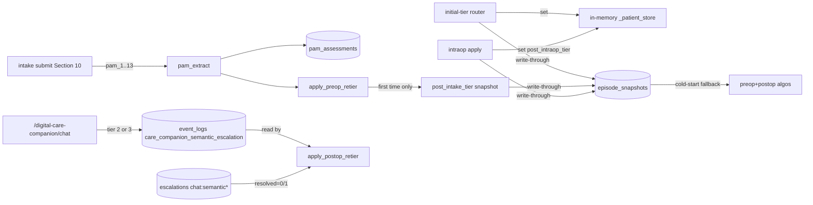

# Triage Suite — Pass 3 Changelog

Pass 3 hardens the four-stage triage suite by giving the two
algorithm-guard fields a persistent home, surfacing the PAM-13 proxy to
patients inside the existing intake flow, wiring the Care Companion's
LLM semantic-escalation verdicts into post-op risk scoring, and
introducing a new `post_intake_tier` snapshot that lets the doctor +
admin surfaces render the full episode tier chain
(`T@upload → T@intake → Now`).

The four PRDs continue to live in `~/Downloads/`; this directory only
holds this changelog (matching the Pass-2 convention).

## Scope decisions (verbatim from the user)

- **Persistence Option A** — new `episode_snapshots` SQLite table for
  the two algorithm-guard fields plus the new `post_intake_tier`
  snapshot. The in-memory `_patient_store` blob remains the hot cache;
  the snapshot row is the source of truth on cold start.
- **PAM-13 in Section 10** — append the 13 PAM proxy items to the
  existing Section 10 ("Day-of-Surgery Readiness") of the intake
  interview. No new section number; no per-section schema rewrite.
- **Care Companion escalation linkage — no `conversation_id`.** A
  semantic escalation is "unresolved" whenever the patient has any
  open `escalations` row whose `trigger_type LIKE 'chat:semantic%'`.
  Closure of that single row clears the contributor.
- **Out of scope (unchanged from Pass 2):** wound-photo upload + nurse
  review + training export, RPM device readings, persisted tuning
  store, auto-rerun of `assign_initial_tier`. The post-intake snapshot
  is the substitute for the auto-rerun pattern.

## Architecture delta



### `episode_snapshots` table (new)

```
episode_snapshots
├── patient_id                       PRIMARY KEY
├── initial_tier_was_hard_escalator  INTEGER NOT NULL DEFAULT 0
├── post_intake_tier                 TEXT
├── post_intraop_tier                TEXT
└── updated_at                       TEXT NOT NULL DEFAULT (datetime('now'))
```

CRUD (`backend/team_store.py`):
- `upsert_episode_snapshot(patient_id, **fields)` — partial upsert.
  Only writes the explicitly passed columns. Unknown fields raise.
- `get_episode_snapshot(patient_id) -> Optional[Dict]` — returns the
  hydrated row dict (`bool` for the boolean flag) or `None`.

Read-through pattern: writers update both the blob and the snapshot
row. The pre-op + post-op `_gather_state` readers prefer the snapshot
row when present (it is at least as fresh as the blob), and hydrate
the blob on the way through so subsequent reads in the same process
are O(1).

## PAM-13 in intake Section 10

`backend/intake_form_parser.py` `_schema()` now carries 13 new fields
inside `section10_dayOfSurgeryReadiness`, named `pam_1`..`pam_13` and
typed as `{"value": "1" | "2" | "3" | "4" | "N_A", "source": ...}`.

`backend/intake_section_chat.py`:
- `SECTION_REFERENCE_FILES[10]` is now a list, concatenating the
  existing Section 10 prompt with the new
  `Sample_Conversation_Section10_PAM_Activation.md`.
- `load_section_reference()` accepts a list and concatenates the files.

`backend/triage/preop_retier/pam_extract.py`:
- `_coerce_value` unwraps the canonical `{value, source}` shape.
- `extract_pam_responses` now also pulls from
  `form_data["section10_dayOfSurgeryReadiness"]`. Existing top-level
  flat keys still work for direct callers / tests.

The `pam_proxy_in_scope` tuning flag was intentionally NOT added — per
the user's instruction the questions are surfaced by default;
absent responses produce `is_complete=False` which the algorithm
treats as the `PAM_NOT_COMPLETED_BY_T_72` contributor.

## Care Companion contributors (Triage Suite Pass 3 §3)

`backend/main.py` chat handler now writes a
`care_companion_semantic_escalation` event whenever
`_evaluate_semantic_escalation_llm` returns a tier-2 or tier-3 verdict
on the chat source. Payload:

```json
{
  "tier": 2 | 3,
  "reason": "<llm reason>",
  "trigger_type": "chat:semantic_tier2 | chat:semantic_tier3",
  "escalation_id": <int>,
  "message_excerpt": "<first 500 chars>"
}
```

New module `backend/triage/postop/scoring/care_companion.py`:

| Function | Reads | Returns |
| --- | --- | --- |
| `count_chat_sessions_total` | `event_logs.avatar_chat` | `int` |
| `count_chat_sessions_last_7d` | `event_logs.avatar_chat` | `int` |
| `latest_semantic_escalation` | `event_logs.care_companion_semantic_escalation` | `dict | None` |
| `has_open_chat_semantic_escalation` | `escalations.trigger_type LIKE 'chat:semantic%'` AND `resolved=0` | `bool` |

New `PostOpReTierInput` fields (default-False / 0):
- `care_companion_red_flag_unresolved`
- `care_companion_tier2_within_24h`
- `care_companion_chat_sessions_last_7d`
- `care_companion_chat_sessions_total`
- `care_companion_episode_past_d7`

Algorithm contributors (added to `triage/postop/hard.py` +
`triage/postop/delta.py`):

| Code | Kind | Weight | Fires when |
| --- | --- | --- | --- |
| `CARE_COMPANION_RED_FLAG_TIER_3` | HARD | — | tier-3 verdict + open `chat:semantic*` row |
| `CARE_COMPANION_SEMANTIC_ESCALATION_TIER_2` | POSITIVE | +2 | tier-2 verdict in last 24h |
| `CARE_COMPANION_ACTIVE_LAST_7D` | ENGAGEMENT_AUDIT | 0 | `chat_sessions_last_7d >= 2` |
| `CARE_COMPANION_NEVER_USED_BY_D7` | POSITIVE | +1 | `chat_sessions_total == 0` and `days_since_discharge >= 7` |

`triage/postop/tuning.py` — `DISABLED_IN_V1["care_companion_enabled"]`
flipped from `False` to `True`. The whole Care Companion contributor
block is gated on this flag inside `_gather_state`, so reverting the
flag suppresses all four contributors.

## `post_intake_tier` snapshot (Pass 3 §4)

`backend/main.py` `_wire_intake_to_pam_and_retier` now stamps
`post_intake_tier` exactly once per episode:

```python
snap = team_store.get_episode_snapshot(patient_id) or {}
if not snap.get("post_intake_tier"):
    new_tier = patient.get("current_tier")
    team_store.upsert_episode_snapshot(patient_id, post_intake_tier=new_tier)
    patient["post_intake_tier"] = new_tier
    team_store.log_event(
        patient_id=patient_id,
        event_type="POST_INTAKE_TIER_SNAPSHOTTED",
        payload={"tier": new_tier, "initialTier": ..., "topReasons": [...]},
    )
```

Once-per-episode by construction (the `if not snap.get(...)` guard).
Subsequent intake submissions fire `apply_preop_retier` again but
leave the original snapshot untouched.

### Doctor + admin surface

- `/api/patients` row now serializes `initialTier`, `postIntakeTier`,
  `currentTier`. The doctor roster (`frontend/doctor.html`) renders
  these as a `T@upload → T@intake → Now` chain with change-indicator
  arrows. CSS lives alongside the existing `postop-tier-badge`
  classes.
- `/admin/stats` (admin dashboard) emits the same three fields per
  recent patient. The admin patients table grew a new "Tier chain"
  column rendered with the same chip styling.
- Both surfaces hydrate `post_intake_tier` from `episode_snapshots`
  when the in-memory blob is empty, mirroring the algorithm-side
  read-through pattern.

### Patient-surface invariant

`backend/tests/test_triage_suite_cohesion.py`
`test_patient_app_html_never_renders_tier_or_score_strings` was
extended with a `post_intake_tier` regex. The grep is clean.

## Tests added

| File | Tests | Purpose |
| --- | --- | --- |
| `backend/tests/test_triage_persistence.py` | 2 | Restart-survival regression for `initial_tier_was_hard_escalator` and `post_intraop_tier` (Pass 3 §1.4). |
| `backend/tests/test_intake_pam_wiring.py` | +2 (5 total) | Section-10 schema-shape PAM submission completes the assessment without firing the not-completed penalty; defensive zero-PAM submission fires the penalty exactly once. |
| `backend/tests/test_postop_care_companion.py` | 6 | All four CC contributors (hard / soft +2 / audit / soft +1), the resolution flow, and the tuning-disabled gate. |
| `backend/tests/test_post_intake_tier_snapshot.py` | 4 | First-intake stamps the snapshot; subsequent signals don't move it; second-intake submission doesn't overwrite; `/api/patients` exposes the tier chain. |

Two existing tests were minimally updated to seed an `avatar_chat`
event (so `CARE_COMPANION_NEVER_USED_BY_D7` doesn't piggy-back onto a
delta they were measuring): `test_postop_router.py::test_dayx_survey_d7_clean_green`
and `test_postop_lifecycle.py::test_full_lifecycle_floor_then_d1_green_then_d7_missed_then_d14_red_flag`.

Final `cd backend && python3 -m pytest tests/ -q` count: **551 passed**
(Pass-2 baseline 529 + 22 net-new).

## v4 follow-ups

These were considered for Pass 3 but explicitly deferred:

- **Persisted tuning store** — the POST tuning admin endpoints still
  return no-op stubs; a `tuning.json` versioned per stage with hot-swap
  still belongs in v4.
- **Wound-photo pipeline** — upload, nurse review, training export,
  and the four `WOUND_PHOTO_*` contributors in
  `triage.postop.tuning`. Flag definitions stay in place but the
  readers continue to return zero/empty.
- **RPM signals** — `rpm_enabled` stays `False` in
  `triage.postop.tuning.DISABLED_IN_V1`. Wiring up wearable / vitals
  feeds is a separate v4 effort.
- **Auto-rerun of `assign_initial_tier`** — the post-intake snapshot
  is the substitute for v3. If the EHR upload comorbidity set is
  later updated, today the team must manually reassign initial tier;
  v4 should add an automatic reassign + audit if the upload payload
  materially changes.
- **Conversation-ID linkage on escalations** — Pass 3 ships without a
  per-conversation key on the `escalations` table by user direction.
  If multi-conversation Care Companion lands later, adding a
  `conversation_id` column and switching the resolution semantics
  from "any open chat:semantic* row" to "this conversation's row" is
  a one-migration change.
