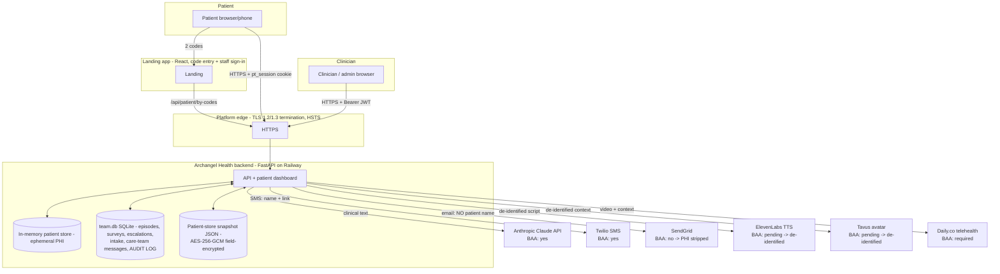

# ePHI Data Flow & System Map

Where protected health information (PHI) enters, lives, moves, and leaves the
system. Supports the §164.308(a)(1) risk analysis and the security-review packet.

## System diagram

## PHI inventory (what we hold)

| Data | Examples | Where it lives at rest |
|---|---|---|
| Identifiers | name, DOB, MRN/MBI, phone, email | in-memory store; `team.db`; encrypted snapshot |
| Clinical | procedure, meds, diagnoses, discharge/pre-op instructions, recovery surveys, intake answers, escalations, care-team messages | `team.db`; in-memory `structured_data`; encrypted snapshot |
| Generated | voice scripts, battlecards, avatar context | in-memory; encrypted snapshot |
| Audit | who accessed which patient, when, outcome | `team.db` (`audit_events`, hash-chained) |

## Access paths

- **Patient** → enters health-system code + resource code on the landing app →
  `/api/patient/by-codes` mints a one-time entry token → exchanged for an 8-hour
  HttpOnly `pt_session` cookie → every patient route requires that session bound to
  that exact patient id (or scoped clinical staff). No anonymous access; wrong/absent
  session returns 404 (no id enumeration).
- **Clinician / admin** → JWT bearer (HS256), role-scoped to their health system
  (tenant isolation), revocable on logout, optional TOTP MFA.

## Subprocessor egress (PHI boundary)

A registry (`backend/compliance/subprocessors.py`) gates PHI: vendors without a
signed BAA receive **de-identified** content (voice/avatar) or **no PHI** (email
name stripped). See `SUBPROCESSORS.md`.

| Vendor | Purpose | PHI sent | BAA |
|---|---|---|---|
| Anthropic (Claude API) | LLM generation/classification | clinical text | Yes (first-party API) |
| Twilio | SMS | name + link | Yes (SMS addendum) |
| SendGrid | email | none (name stripped) | No — not HIPAA-eligible |
| ElevenLabs | TTS voice | de-identified script | Pending |
| Tavus | AI avatar | de-identified context | Pending |
| Daily.co | telehealth video | video + clinical context | **Required — execute BAA** |
| Railway (hosting) | compute + storage | all at rest | Confirm BAA / volume encryption |
